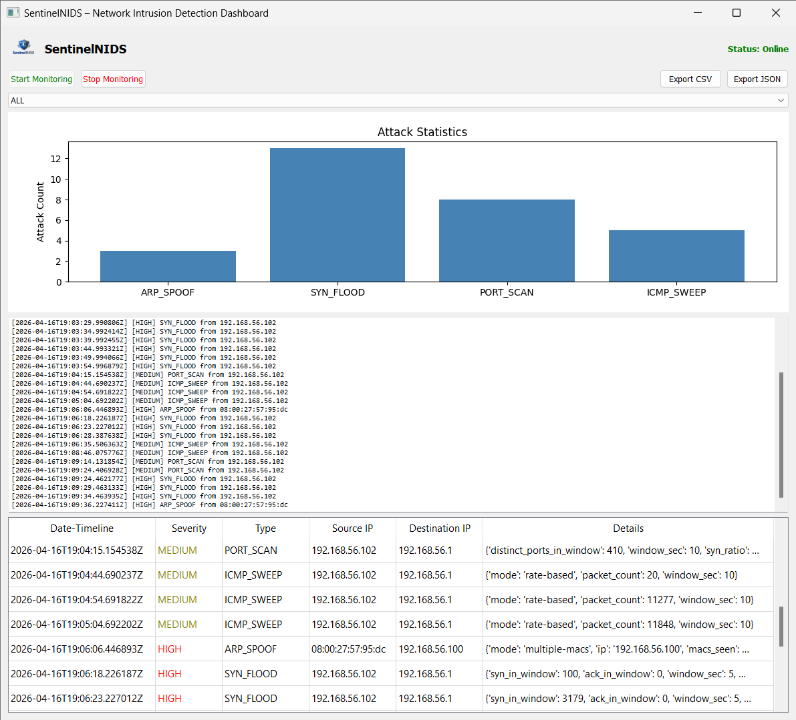
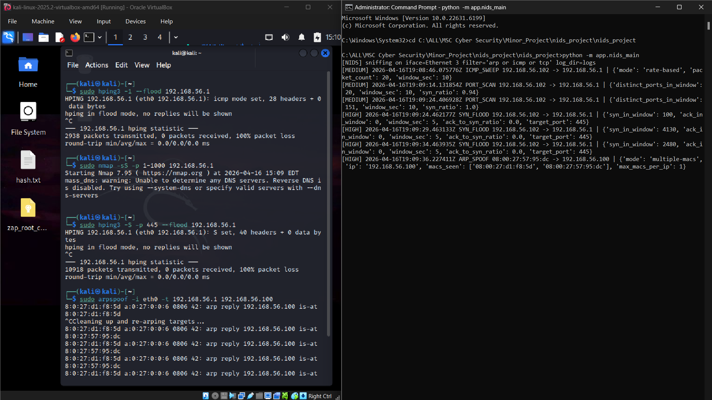
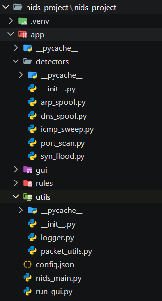
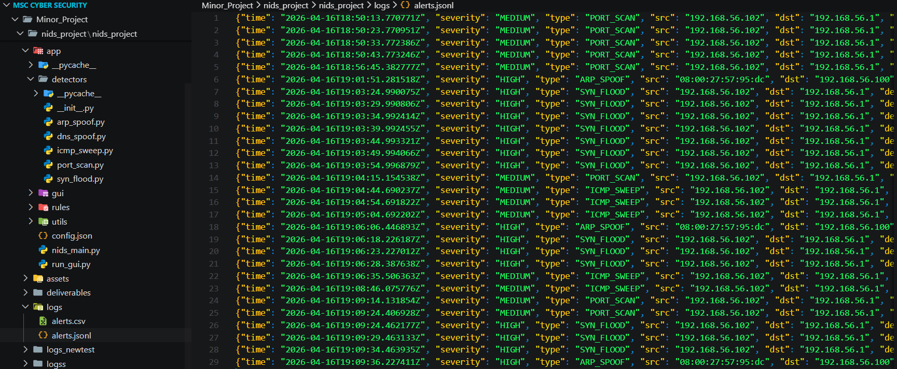
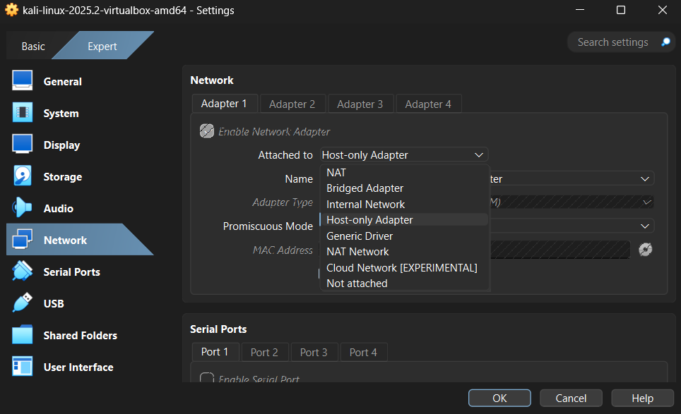

# Network Intrusion Detection System (NIDS) — Minor Project

## Author & Acknowledggments

* **Author:** Laxman Narvenkar
* **Degree:** M.Sc. Cyber Security
* **Institution:** National Forensic Sciences University (NFSU)
* **Project Type:** Academic Minor Project

## System Requirements

* **Operating System:** Windows 10/11 or Linux (Kali / Ubuntu)
* **Python Version:** Python 3.10 or higher
* **Required Libraries:** `scapy`, `matplotlib`, `tkinter`
* **Driver Requirements:** Npcap (Windows) or root access (Linux) for raw packet capturing

## Tech Stack


## Future Roadmap

- [ ] Add machine learning model integration for anomaly-based detection.
- [ ] Implement automated email / Webhook alerts for `HIGH` severity threats.
- [ ] Support PCAP file upload for offline forensic analysis.


## Run (one-click)
- **Windows:** double-click `run_nids.bat` (run Command Prompt as Administrator if capture fails)
- **Linux/macOS:** `bash run_nids.sh` (use `sudo bash run_nids.sh` if capture fails)

## Run (manual)
```bash
python -m venv .venv
source .venv/bin/activate  # Windows: .venv\Scripts\activate
pip install -r requirements.txt
python code/nids_main.py --iface <iface> --log-dir logs
```

## System Architecture & Diagrams

### 1. High-Level System Architecture


---

### 2. Detection Logic & Sequence Flow

| Detection Logic Flowchart | Incident Response Sequence Diagram |
| :---: | :---: |
|  |  |

---

### 3. Structural & Functional Modeling

| System Class Diagram | Actor Use Case Diagram |
| :---: | :---: |
|  |  |

## Outputs
Alerts -> `logs/alerts.jsonl` and `logs/alerts.csv`

## Project Showcase

### SentinelNIDS GUI Dashboard


### Real-Time Attack Simulation & Detection


### Modular Code Architecture


### Structured Alert Logs (`alerts.jsonl`)


### VirtualBox Host-Only Network Setup


Generated: 2026-01-15 08:29
